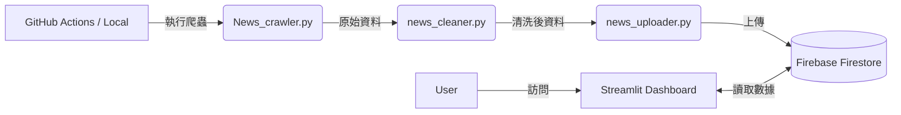

# 📰 ETtoday 新聞輿情分析系統 (News Sentiment & Analysis Dashboard)

[](https://www.python.org/)
[](https://streamlit.io/)
[](https://firebase.google.com/)


這是一個全自動化的新聞輿情分析系統，專門針對 **ETtoday 新聞雲** 進行資料蒐集與分析。
透過 GitHub Actions 實現每日自動爬蟲，並結合 Firebase Firestore 與 Streamlit 打造即時互動儀表板，提供記者戰力分析、熱門關鍵詞雲與發文趨勢觀察。

## 🚀 功能特色

* **自動化爬蟲 (Web Crawler)**：
    * 使用 Selenium 模擬真人瀏覽行為，具備自動捲動 (Infinite Scroll) 與防偵測機制。
    * 支援 Headless 模式，可於伺服器端背景執行。
    * 自動偵測日期邊界，精準抓取特定日期區間的新聞。
* **資料清洗與 NLP (Data Cleaning)**：
    * 自動過濾非記者署名（如「翻攝」、「網友提供」）。
    * 整合 Jieba 斷詞系統，提取新聞標題中的熱門關鍵詞。
    * 使用 MD5 雜湊網址作為唯一 ID，防止資料重複儲存。
* **雲端資料庫 (Cloud Database)**：
    * 整合 Google Firebase (Firestore)，支援高併發讀寫與即時同步。
* **互動式儀表板 (Dashboard)**：
    * **關鍵詞文字雲**：視覺化當日最熱門議題。
    * **記者戰力分析**：統計記者發稿量排名。
    * **多維度篩選**：支援依日期、類別進行資料過濾。
* **CI/CD 自動化**：
    * 整合 GitHub Actions，每日定時自動執行爬蟲與資料更新。
    * 自動執行「爬取 -> 清洗 -> 去重 -> 上傳」流程，無需人工介入。
    * 實作 Secrets 管理，確保雲端金鑰安全。

## 🛠️ 系統架構


## 📂 檔案結構說明

| 檔名 | 類別 | 說明 |
| :--- | :--- | :--- |
| `app.py` | 應用程式 | Streamlit 戰情室主程式，負責前端介面與資料視覺化 |
| `News_crawler.py` | 資料管線 | 爬蟲核心，負責從新聞網站抓取原始 HTML 資料 |
| `news_cleaner.py` | 資料管線 | 負責資料清洗、欄位標準化 (ETL Process) |
| `news_uploader.py` | 資料管線 | 負責產生去重 ID 並將資料上傳至 Firestore |
| `check_count.py` | 維運工具 | **成本優化工具**，利用 Aggregation Query 快速查詢資料庫總筆數 (不消耗大量讀取額度) |
| `.github/workflows/` | 自動化 | GitHub Actions CI/CD 自動化腳本設定檔 |
| `requirements.txt` | 設定檔 | 專案相依套件列表 |

## 💻 安裝與執行 (Local Development)
1. 複製專案
```
git clone [https://github.com/你的帳號/你的專案名稱.git](https://github.com/你的帳號/你的專案名稱.git)
cd 你的專案名稱
```
2. 安裝依賴套件
```
pip install -r requirements.txt
```
3.  設定 Firebase 金鑰
本專案需要 Firebase Admin SDK 的金鑰 (serviceAccountKey.json)。
請將金鑰檔案放入專案根目錄。
注意：請勿將此金鑰上傳至 GitHub (已加入 .gitignore)
4.  執行流程
```
1. 抓取新聞 (預設抓取 1 天)
python News_crawler.py

2. 清洗資料
python news_cleaner.py

3. 上傳至 Firebase
python news_uploader.py
```
5.  啟動儀表板
```
streamlit run app.py
```

## ☁️ 部署 (Deployment)
GitHub Actions (後端自動化)
本專案包含 .github/workflows/daily_scrape.yml，設定為 每天 UTC 00:00 (台灣時間 06:00) / UTC 06:00 (台灣時間 14:00) / UTC 12:00 (台灣時間 20:00) / UTC 18:00 (台灣時間 02:00)自動執行爬蟲。

需在 GitHub Repo Settings 中設定 Secrets: FIREBASE_CREDENTIALS。

Streamlit Cloud (前端網頁)
本專案支援直接部署至 Streamlit Community Cloud。

需在 Streamlit Cloud 的 Advanced Settings 中設定 Secrets ([firebase]).
